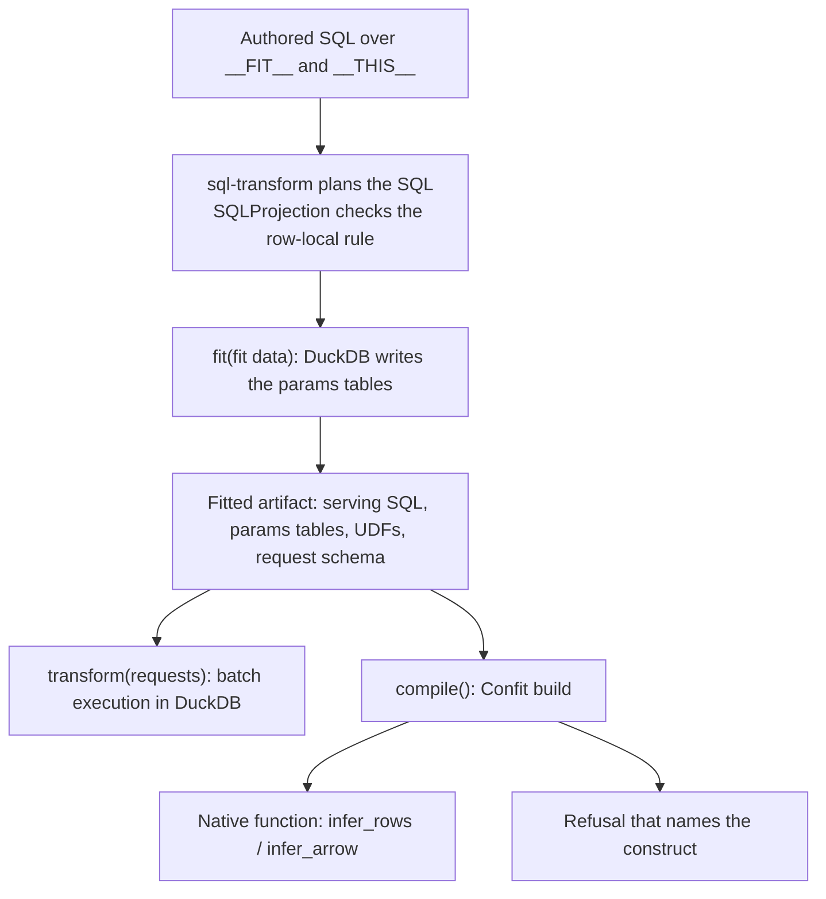

# SQL Transforms

Write a feature transform in SQL, fit it once, and serve it one request at a
time.

- You write SQL over two tables: the fit data `__FIT__` and the request table
  `__THIS__`.
- Fit runs the fit part of the SQL in DuckDB once. It writes the results to
  params tables.
- Confit builds the fitted SQL and its params tables into a native function.
  The function answers each request without DuckDB.
- The answers of the function are bit-exact with the oracle: DuckDB 1.5.5 with
  the optimizer off. If Confit cannot serve a construct bit-exact, the build
  stops with a refusal that names the construct.

The [glossary](GLOSSARY.md) defines the terms of this project.

## Packages

| Package | What it is |
|---|---|
| [`sql-transform`](packages/sql-transform) | The authoring package. `SQLTransform` composes, fits and runs general SQL transforms in batch. `SQLProjection` adds the row-local rule, so that a fitted projection can compile to a Confit function. The native catalog translates fitted scikit-learn transformers into transforms that Confit serves. |
| [`confit`](packages/confit) | The serving engine. It builds SQL and its static tables into a native function. You can use it without sql-transform. |

sql-transform builds on Confit. Confit does not import sql-transform.

## Example

```python
import pyarrow as pa
from sql_transform import SQLProjection

fit_data = pa.table({"g": ["a", "a", "b"], "v": [10.0, 20.0, 7.0]})
requests = pa.table({"g": ["a", "b", "new"], "v": [12.0, 9.0, 5.0]})

projection = SQLProjection("""
    WITH p AS (SELECT g, avg(v) AS m FROM __FIT__ GROUP BY g)
    SELECT t.g, t.v - p.m AS d
    FROM __THIS__ t LEFT JOIN p ON t.g = p.g
""")
fitted = projection.fit(fit_data)

# Batch execution in DuckDB. An unseen key gives NULL.
assert fitted.transform(requests).to_pydict() == {
    "g": ["a", "b", "new"], "d": [-3.0, 2.0, None]}

# Build a Confit function, then answer one request.
fn = fitted.compile()
assert fn.infer_rows([{"g": "a", "v": 12.0}]) == [{"g": "a", "d": -3.0}]
```

Fit replaced the fit query with a params table. The serving SQL
(`fitted.sql`) reads only the request table and that params table:

```sql
SELECT t.g, (t.v - p.m) AS d FROM __THIS__ AS t
LEFT JOIN __param_p AS p ON ((t.g = p.g))
```

`SQLProjection.marginalize` gives the same transform from window SQL:
`SELECT g, v - avg(v) OVER (PARTITION BY g) AS d FROM __THIS__`.

You can also use Confit alone, with SQL and static tables that you supply:

```python
import pyarrow as pa
from confit import DuckDBInferFn

fn = DuckDBInferFn(
    "SELECT (age - 30.0) / 10.0 AS age_z FROM __THIS__",
    row_tables={"__THIS__": pa.schema([("age", pa.float64())])},
    static_tables={},
    shape="map",
)
assert fn.infer_rows([{"age": 40.0}]) == [{"age_z": 1.0}]
assert fn.infer_arrow(pa.table({"age": [40.0]})).to_pydict() == {"age_z": [1.0]}
```

## How the parts fit together



Three checks are separate:

1. sql-transform must resolve and plan the SQL.
2. `SQLProjection` must find that each request gets one answer that does not
   depend on other requests.
3. Confit must build the fitted SQL, or it refuses.

If a fitted projection runs in batch, Confit can still refuse to build it.
General `SQLTransform` has no row-local rule and runs only in batch.

## The serving guarantee

For each build, Confit gives one of two outcomes:

1. a function whose answers are bit-exact with the oracle, or
2. a refusal at build time that names the construct that Confit does not serve.

The contract forbids a third mode: a build that succeeds and a function that
answers differently. The corpus has 678 SQL statements from DuckDB's own test
suite. Confit serves **543 of 678** bit-exact and refuses the others
(2026-10-05, [counts](packages/confit/docs/reports/corpus-counts.json)).
[Known limitations](packages/confit/docs/known-limitations.md) lists the
refusals and the reasons for them.

## Install

The packages are not on PyPI. The `confit` package on PyPI is a different
project. Install from a clone of this repository.

You need these tools:

- [uv](https://docs.astral.sh/uv/). uv installs Python 3.14 if necessary.
- A Rust toolchain. [maturin](https://www.maturin.rs/) uses it to build
  Confit's extension module (`confit._engine`).

```bash
git clone https://github.com/ahrzb/sql-transforms.git
cd sql-transforms
uv sync          # installs both packages and builds Confit's extension
```

If you use [mise](https://mise.jdx.dev/), `mise run install` runs `uv sync`.
If you use Nix, `nix develop` gives a shell with the pinned toolchain: Python
3.14, uv, Rust, and JDK 21.

## Development

The gate is the full test run. It must pass before a push.

```bash
uv run python scripts/gate.py    # cargo test, then pytest on 4 workers
```

Use these commands for shorter loops:

```bash
uv run pytest -q packages/sql-transform   # one package
mise run fmt                              # ruff check and ruff format
mise tasks                                # all mise tasks
```

- After you change Rust code, run `uv run maturin develop` in
  `packages/confit`. The tests also rebuild the extension when a `.rs` file is
  newer than the built module.
- The cross-engine dialect tests need PySpark and JDK 21. Install PySpark with
  `uv sync --group spark`.

## Repository layout

| Path | Contents |
|---|---|
| `packages/sql-transform` | The authoring package and the native catalog (`sql_transform.native`), with their spec, research, plans and records |
| `packages/confit` | The serving engine: Rust source in `src`, the Python package in `confit`, tests, and docs |
| `docs/specs` | The index of the current system specification |
| `benchmarks` | Serving and transform benchmarks |
| `scripts` | The gate and maintenance scripts |
| `loops` | The plans, decision records and reports of the agent loops for Confit and the native catalog |

## Documentation

- [System specification](docs/specs/README.md): the index of the current
  specification, by topic.
- [sql-transform spec](packages/sql-transform/spec/README.md): the
  sql-transform API, fit, composition, estimators, the native catalog, and
  the [unsupported forms and their explicit alternatives](packages/sql-transform/spec/unsupported-forms.md).
- [Serving contract](packages/confit/docs/specs/serving-contract.md): the
  Confit API, shapes, types, and UDFs.
- [Known limitations](packages/confit/docs/known-limitations.md): the
  constructs that Confit refuses.

Reports:

- [The architecture of Confit](packages/confit/docs/reports/confit-architecture.md)
- [Pins-first: building a bit-exact engine twin](packages/confit/docs/reports/pins-first-methodology.md)
- [Performance: the serving regime, measured](packages/confit/docs/reports/performance-report.md)
